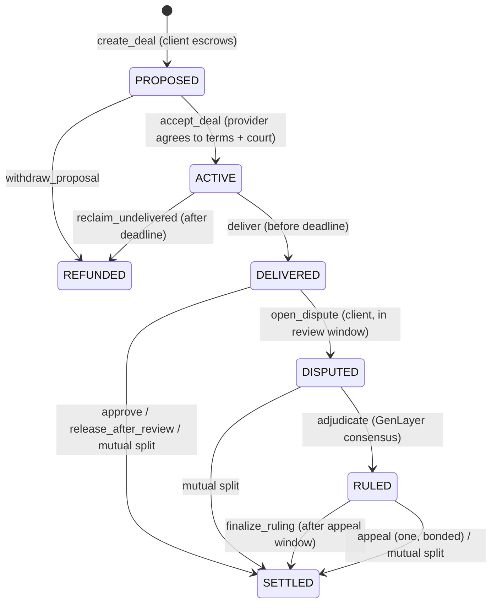

# DealCourt — escrow + adjudication primitive for agent-to-agent deals

[](LICENSE)

**DealCourt** is a standalone GenLayer Intelligent Contract that lets two
parties — autonomous agents or humans — strike a service deal where **the
dispute process is agreed up front**: escrow, terms, a rubric, deadlines, and a
GenLayer court that decides a *payout split* if the deal goes wrong.

It implements the verification & disputes layer of the
[Internet Court](https://github.com/internet-court/internet-court-skill) model:

> Discovery and identity establish who. Negotiation and contracts set the terms.
> Payment and escrow move or lock the funds. Execution does the work.
> **Adjudication decides what happened and writes the verdict back as reputation.**

Most deals never reach the court: the client approves, the review window lapses
(silence is consent), or the parties agree a split. Only real disputes pay for
LLM consensus.

## Why it is more than an LLM wrapper

| Design element | What it does |
|---|---|
| **Split-tolerance consensus** | The ruling is a number (provider share, 0–10 000 bps). Validators re-judge independently and accept if they are within **±15 points**, reach the **same decision class** (RELEASE ≥ 90 %, SPLIT, REFUND ≤ 10 %) and judge the **same number of rubric criteria met (±1)**. |
| **Derived, not trusted, decisions** | The decision class is recomputed from the bps; a leader payload whose `decision` disagrees with its own number is rejected. |
| **Boundary protection** | 88 % (SPLIT) vs 95 % (RELEASE) are within tolerance numerically but flip the outcome — the class check catches it. |
| **Error classes** | `[EXPECTED]` / `[EXTERNAL]` must match exactly, `[TRANSIENT]` agree-to-fail, `[LLM_ERROR]` always disagree (forces rotation) — the official GenLayer pattern. |
| **Dead links can't stall** | Unreachable evidence becomes `[UNAVAILABLE]` instead of reverting, so a party cannot block adjudication. |
| **Prompt-injection hardening** | All party-written text is fenced with `<<< >>>`, delimiters inside it are neutralised, and the rules state party text is evidence, never instructions. The LLM outputs a share; money flow is computed deterministically. |
| **One bonded appeal** | The party that received less can appeal once with new evidence and a 5 % bond. The appeal panel sees the prior ruling as context. The bond is refunded only if the split moves ≥ 10 points in the appellant's favour, otherwise it compensates the counterparty. |
| **Exact accounting** | `provider = amount * bps // 10000`, `client = amount - provider` — no dust lost (tested with an odd amount). |
| **Reputation write-back** | `completed`, `disputes_won`, `disputes_lost` per address; providers who accept and never deliver take a loss. |

## State machine



## API

| Method | Who | Notes |
|---|---|---|
| `create_deal(provider, title, terms, rubric_json, delivery_seconds, review_seconds)` payable | client | rubric = JSON list of 1–8 criteria |
| `accept_deal(id)` | provider | binds the provider to terms + adjudication |
| `withdraw_proposal(id)` | client | before acceptance |
| `deliver(id, uri, note)` | provider | before delivery deadline |
| `approve(id)` | client | 100 % to provider |
| `release_after_review(id)` | anyone | after review window, no dispute |
| `reclaim_undelivered(id)` | client | after delivery deadline |
| `propose_settlement(id, bps)` | either party | identical proposals settle instantly |
| `open_dispute(id, statement, uris_json)` | client | inside review window; ≤3 evidence URLs |
| `submit_evidence(id, statement, uris_json)` | provider | once, inside 3-day evidence window |
| `adjudicate(id)` | anyone | after both filed or window closed |
| `appeal(id, statement, uris_json)` payable | losing party | once, bond ≥ 5 %, within 2 days |
| `finalize_ruling(id)` | anyone | after appeal window |
| `get_deal`, `get_evidence`, `get_reputation`, `get_proposal`, `get_deal_count` | view | |

### Ruling payload (stored, sorted JSON)

```json
{
  "provider_share_bps": 6000,
  "decision": "SPLIT",
  "criteria_met": 3,
  "criteria_total": 4,
  "violations": ["missing code example"],
  "reasoning": "…"
}
```

`examples/agent_client.ts` maps this to the Internet Court
`AgentReviewDecision` shape (`decision`, `score`, `reasoning`, `violations`).

## Run

```bash
python3 -m venv .venv && source .venv/bin/activate
pip install -r requirements.txt
genvm-lint check contracts/deal_court.py
pytest tests/direct/ -v          # 32 tests
gltest tests/integration/ -v -s  # needs Studio / testnet
```

## Tests (32 direct)

- **Lifecycle**: escrow, validation, permissions, withdraw, approve, silence-is-consent, reclaim + reputation penalty, late delivery, mutual split, outsider block, no-dust split.
- **Events**: regression test proving indexed event fields are not swapped (the SDK binds positional indexed args alphabetically — see note in the contract).
- **Disputes**: windows, evidence once, adjudication with missing evidence, RELEASE/SPLIT/REFUND payouts + reputation, successful appeal (bond refunded), failed appeal (bond forfeited), appeal eligibility, prior-ruling context in appeal prompt, settlement after ruling, dead evidence links, prompt fencing, share parsing (`"75%"`).
- **Consensus (validator replay)**: accepts within tolerance; rejects >15 pt gap, class flip at the 90 % boundary, criteria disagreement, inconsistent/out-of-range leader payloads, and LLM errors.

## Reuse

DealCourt is deliberately generic: freelance gigs, agent API jobs (x402-paid
work with an escrowed SLA), content commissions, data deliveries. Swap the
rubric and terms; the court, the consensus rule and the settlement maths stay
the same.

## License

MIT
